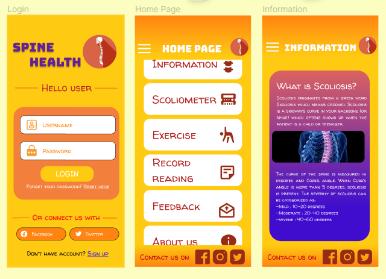

# SpineHealth
This proposed application aims to address the challenge of scoliosis among young people today, a condition characterized by a lateral curvature of the spine typically diagnosed during adolescence. Scoliosis can manifest in individuals with conditions like cerebral palsy and muscular dystrophy. This initiative aligns with 🌱**target 3.4 — _By 2030, reduce by one third premature mortality from non-communicable diseases through prevention and treatment, promoting mental health and  well-being._** The focus is on prevention, treatment, and the promotion of mental health and well-being in order to contribute to this SDG 3 target.

### Main application tasks
- Online chatting with specialists and consultants
- Track back the history of the measurement of their degree of spinal curvature
- Scoliometer to measure the degree of curvature of the users’ spine

The development of this application was guided by the principles and requirements outlined in the Human Computer Interaction (HCI) course. The HCI course likely provided insights into creating an interface that enhances the interaction between users and the system, ensuring usability, accessibility, and overall user satisfaction. By incorporating HCI principles, the application aims to deliver an effective and user-friendly experience, taking into consideration the needs and preferences of the intended users.

#### 🤘Feel free to check out the project links below:
- [Low-fidelity prototype presentation link](https://www.figma.com/proto/ixVhYr8hxoyeHe6lq2k3z3/HCI-Project-Prototype?node-id=6%3A45&scaling=scale-down&page-id=0%3A1&starting-point-node-id=6%3A45)
- [Project video](https://www.youtube.com/watch?v=a3k0dmp5k98)

